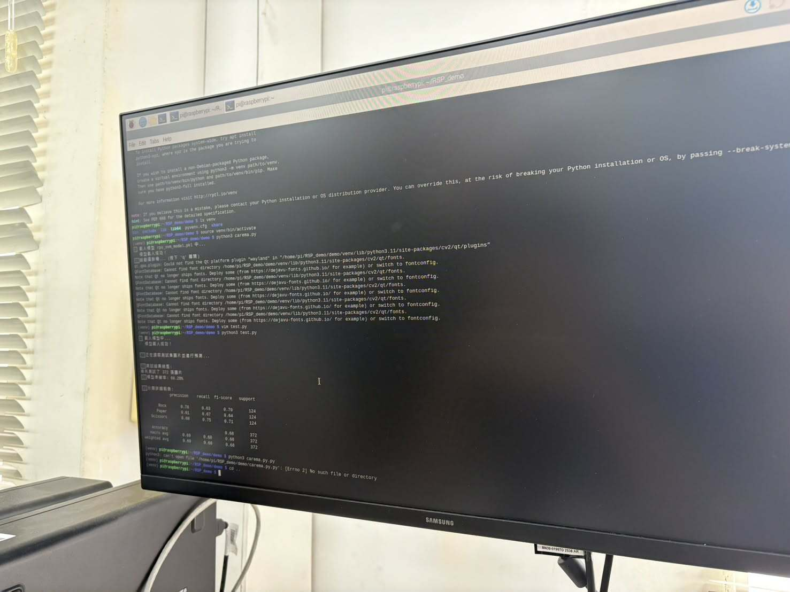
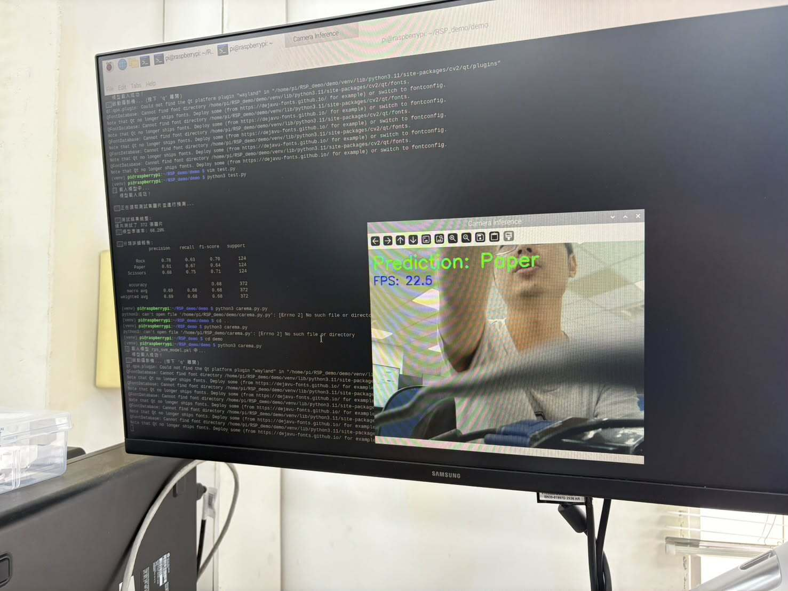

# 石頭、剪刀、布手勢辨識專題報告

**課程**：AIoT 應用實作  
**平台**：Raspberry Pi 4  
**模型最終選用**：EfficientNetB0（Transfer Learning）  
**GitHub**：https://github.com/BiBaIsAFish/RSP_demo

---

## Part 1. Raspberry Pi 4 實機執行截圖

### test.py 執行截圖



- 執行指令：`python3 test.py`
- 於 Raspberry Pi 4 上成功載入模型並完成測試集評估
- 輸出包含 Accuracy、Precision、Recall、F1-score 等完整指標

---

### carema.py 執行截圖



- 執行指令：`python3 carema.py`
- 於 Raspberry Pi 4 上成功開啟攝影機並進行即時推論
- 畫面顯示 `Prediction: Paper`，FPS 約 22.5

---

## Part 2. Demo 展示影片

**YouTube 連結**：`https://youtu.be/hNdXaP3jzTQ`

Demo 影片包含以下手勢展示：

- 石頭 (Rock) × 3
- 布 (Paper) × 3
- 剪刀 (Scissors) × 3
- 其他錯誤手勢 (Error) × 1

共計 10 次手勢辨識，使用模型為 **EfficientNetB0**。

---

## Part 3. 報告

### 3.1 專案背景與問題描述

本專案目標為在 Raspberry Pi 4 上實作即時手勢辨識，辨識類別為石頭、剪刀、布三類。

原始 baseline 採用 **RBF SVM**，以灰階影像展平為 4096 維向量後訓練。SVM 在靜態測試集上可達 **68.28%** 準確率，但在實機攝影機環境下出現明顯問題：模型幾乎無腦輸出單一類別，完全無法隨手勢變化而改變預測。

分析原因如下：

1. **RBF Kernel 的距離問題**：RBF Kernel 以特徵空間中的歐式距離計算相似度。訓練資料與真實攝影機環境（背景、光線、角度）差異極大，導致輸入向量在高維空間中遠離訓練分佈，Kernel 相似度趨近 0，模型最終只輸出偏差項最大的類別。

2. **Flatten 特徵缺乏結構性**：直接展平灰階像素使背景雜訊與手勢輪廓混在一起，模型無法學到具意義的幾何或紋理特徵。

3. **資料集分佈不一致（Out-of-Distribution）**：測試集與訓練集來自同一拍攝環境，因此離線準確率正常；而真實攝影機屬於全新分佈，SVM 的決策邊界無法泛化。

---

### 3.2 模型選型說明

為解決上述問題，本專案自行選定並實作了兩個新的模型架構：

#### 選型一：Small CNN（自建卷積神經網路）

**選型理由**：
- SVM 的核心問題在於特徵品質差；CNN 可透過卷積層自動學習局部空間特徵（如手指輪廓、關節區塊），對背景雜訊有更強的抵抗力。
- 自建小型 CNN 不依賴預訓練權重，可完全從本資料集學習，結構輕量，適合作為深度學習入門對照組。

**架構設計**：

```
輸入：64×64 RGB
Conv2D(32) + BatchNorm + ReLU
Conv2D(32) + BatchNorm + ReLU + MaxPool2D
Conv2D(64) + BatchNorm + ReLU
Conv2D(64) + BatchNorm + ReLU + MaxPool2D
Conv2D(128) + BatchNorm + ReLU + MaxPool2D
GlobalAveragePooling2D
Dense(64) + Dropout(0.5)
Dense(3, softmax)
```

---

#### 選型二：EfficientNetB0（遷移學習）

**選型理由**：
- MobileNetV2 在此資料集雖然離線準確率高（93.82%），但在 Pi 實機測試中對光線與背景變化仍較敏感。
- EfficientNetB0 採用 Compound Scaling 方法，在相同計算量下同時縮放深度、寬度與解析度，特徵表達能力更強，在面對真實攝影機輸入時理論上具有更好的泛化能力。
- ImageNet 預訓練的通用視覺特徵可減輕資料集規模有限帶來的過擬合風險。

**架構設計**：

```
輸入：224×224 RGB（使用官方 EfficientNet 預處理，像素值映射至 [-1, 1]）
EfficientNetB0 backbone（ImageNet 預訓練，訓練時 frozen）
GlobalAveragePooling2D
Dropout(0.2)
Dense(128, ReLU)
Dropout(0.2)
Dense(3, softmax)
```

**訓練設定**：
- Optimizer：Adam
- Loss：sparse categorical crossentropy
- Batch Size：16
- Early Stopping：patience=3
- 最大 Epoch：10

---

### 3.3 實驗結果比較

#### 3.3.1 Baseline SVM（RBF Kernel）

| 類別 | Precision | Recall | F1-score | Support |
|---|---:|---:|---:|---:|
| Rock | 0.78 | 0.63 | 0.70 | 124 |
| Paper | 0.61 | 0.67 | 0.64 | 124 |
| Scissors | 0.68 | 0.75 | 0.71 | 124 |
| **Accuracy** | | | **68.28%** | 372 |
| macro avg | 0.69 | 0.68 | 0.68 | 372 |

---

#### 3.3.2 Small CNN（自建 CNN）

| 類別 | Precision | Recall | F1-score | Support |
|---|---:|---:|---:|---:|
| Rock | 0.79 | 1.00 | 0.88 | 124 |
| Paper | 0.84 | 0.70 | 0.76 | 124 |
| Scissors | 0.89 | 0.80 | 0.84 | 124 |
| **Accuracy** | | | **83.33%** | 372 |
| macro avg | 0.84 | 0.83 | 0.83 | 372 |

---

#### 3.3.3 EfficientNetB0（遷移學習）

| 類別 | Precision | Recall | F1-score | Support |
|---|---:|---:|---:|---:|
| Rock | 0.78 | 1.00 | 0.88 | 124 |
| Paper | 1.00 | 0.62 | 0.77 | 124 |
| Scissors | 0.91 | 1.00 | 0.95 | 124 |
| **Accuracy** | | | **87.37%** | 372 |
| macro avg | 0.90 | 0.87 | 0.87 | 372 |

---

#### 3.3.4 三模型比較總表

| 模型 | Accuracy | Macro Precision | Macro Recall | Macro F1 |
|---|---:|---:|---:|---:|
| Baseline SVM | 68.28% | 0.69 | 0.68 | 0.68 |
| Small CNN | 83.33% | 0.84 | 0.83 | 0.83 |
| EfficientNetB0 | 87.37% | 0.90 | 0.87 | 0.87 |

---

### 3.4 模型差異分析

#### 4.1 SVM vs CNN 類模型

| 面向 | Baseline SVM | Small CNN / EfficientNetB0 |
|---|---|---|
| 特徵擷取方式 | 手動（灰階展平） | 自動（卷積層學習） |
| 對背景雜訊的抵抗力 | 低 | 中～高 |
| 離線準確率 | 68.28% | 83%～87% |
| 實機泛化能力 | 極差（單一類別輸出） | 明顯改善 |
| 樹莓派部署難度 | 低 | 中 |

SVM 的根本問題在於將像素直接展平為特徵向量，這個做法使背景像素對預測結果產生極大影響。CNN 透過卷積核學習局部結構特徵（如邊緣、輪廓、關節位置），對輸入的小幅變化有更好的容忍度，因此在實機攝影機場景下表現遠優於 SVM。

#### 4.2 Small CNN vs EfficientNetB0

| 面向 | Small CNN | EfficientNetB0 |
|---|---|---|
| 預訓練 | 無（從頭訓練） | ImageNet 預訓練 |
| 輸入尺寸 | 64×64 | 224×224 |
| 參數量 | 小 | 中（約 5.3M，但 backbone frozen） |
| 訓練資料依賴 | 較高（容易過擬合） | 較低（backbone 提供通用特徵） |
| 離線 Accuracy | 83.33% | 87.37% |
| Pi 上 FPS | 較高 | 約 22.5 FPS（實測） |

Small CNN 雖然架構簡單、參數少，但在資料集規模有限的情況下，缺乏足夠多樣的訓練資料支撐，容易對訓練集過擬合，導致實機測試時出現偏向單一類別的現象。

EfficientNetB0 因為 backbone 已在 ImageNet 上學到豐富的通用視覺特徵（邊緣、紋理、形狀），即使在僅有數百張手勢照片的小資料集上進行 fine-tune，仍能保有良好的泛化能力。這使得 EfficientNetB0 在面對不同光線、背景與手勢角度時，表現明顯比從頭訓練的 Small CNN 更為穩定。

**最終選擇 EfficientNetB0 作為 Demo 主力模型的原因**：
1. 離線準確率（87.37%）高於 Small CNN（83.33%）
2. 在 Raspberry Pi 4 實機測試中可達約 22.5 FPS，滿足即時 Demo 需求
3. 實際手勢辨識穩定度較佳，三種手勢均可正確辨識

---

### 3.5 程式碼說明

本專案程式碼結構如下：

| 檔案 | 說明 |
|---|---|
| `model_utils.py` | 共用前處理、特徵擷取、評估工具 |
| `train/train_svm.py` | Baseline SVM 訓練 |
| `train/train_small_cnn.py` | Small CNN 訓練 |
| `train/train_efficientnetb0.py` | EfficientNetB0 訓練 |
| `demo/test.py` | 統一測試入口（支援 .pkl / .keras） |
| `demo/carema.py` | 即時攝影機推論（支援多模型格式） |

完整程式碼請參閱：https://github.com/BiBaIsAFish/RSP_demo

---

### 3.6 AI 協作對話

本專案全程使用 **Kiro（Claude Sonnet 4.6）** 進行 AI 協作開發，對話紀錄完整保存於專案根目錄的 `聊天紀錄.md` 中。

主要 AI 協作項目包含：

- 分析 baseline SVM 在實機攝影機上失效的根本原因
- 設計 `model_utils.py` 共用模組，統一三種模型的前處理與評估介面
- 實作 Small CNN 與 EfficientNetB0 的完整訓練流程
- 修正 `carema.py` 的模型分流邏輯，確保各模型使用正確前處理
- 除錯 Raspberry Pi 上因頂層 import 導致的 `ModuleNotFoundError` 問題
- 整合 ROI 預覽視窗與即時分數顯示，方便實機 debug

對話紀錄與本報告可互相對照，作為 AI 協作開發流程的完整佐證。
