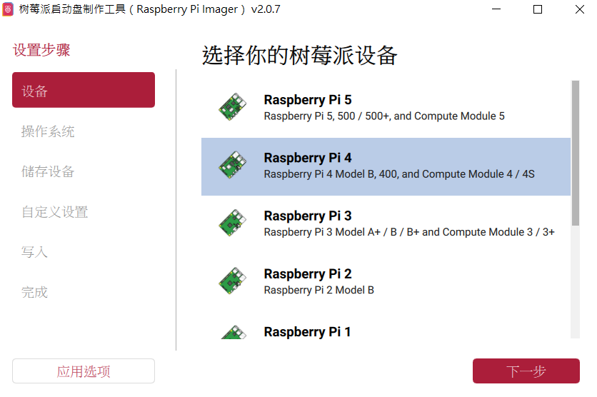
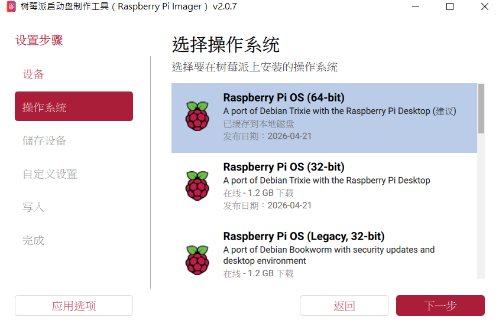
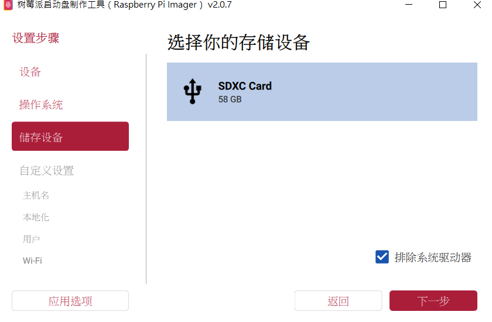
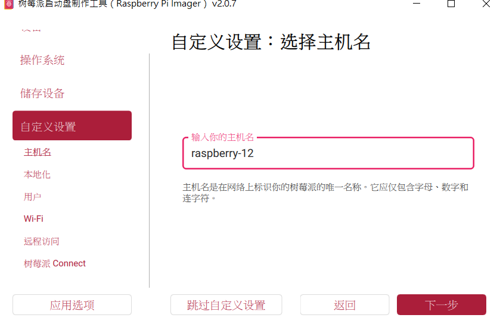
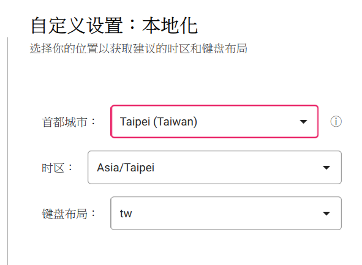
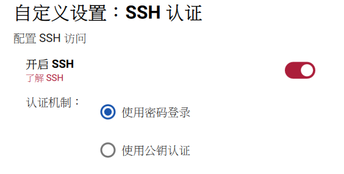
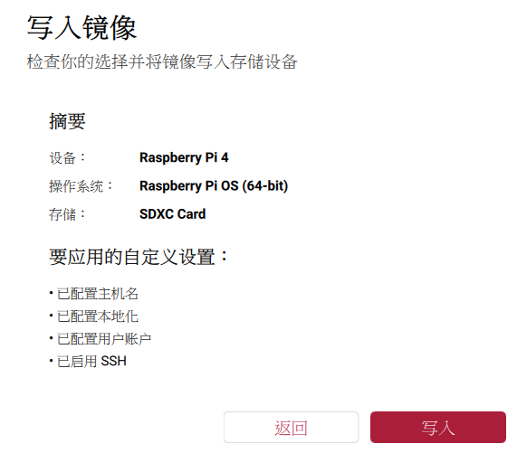
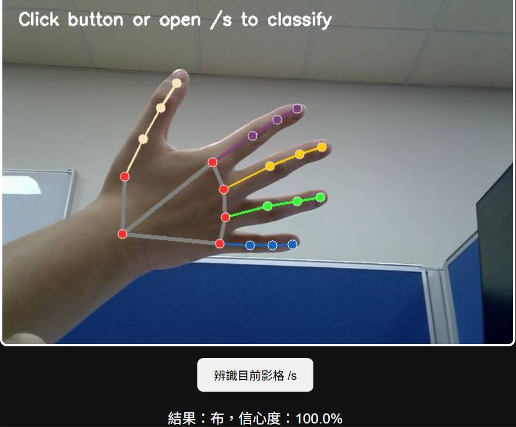
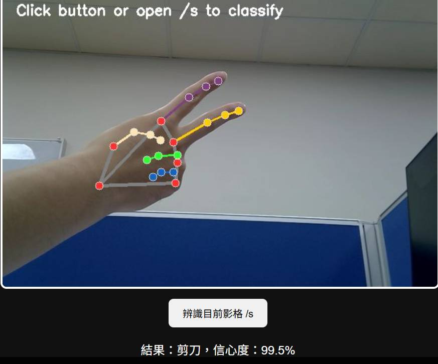

# 石頭、剪刀、布手勢辨識專題完整報告

## 4112064224 電資三 范詠竣

**課程**：AIoT 應用實作  
**實作平台**：Raspberry Pi 4  
**開發語言**：Python  
**主要套件**：OpenCV、scikit-learn、scikit-image、TensorFlow / Keras  
**最終展示模型**：EfficientNetB0 Transfer Learning  
**GitHub**：https://github.com/JIMFAN1014/AIOT_HW4_RSP 
**Demo 影片**：https://youtu.be/hNdXaP3jzTQ

---

## 摘要

本專題目標是在 Raspberry Pi 4 上完成一套可即時運作的石頭、剪刀、布手勢辨識系統。系統需能讀取攝影機畫面，對使用者手勢進行分類，並在畫面上即時顯示辨識結果與 FPS。辨識類別包含 Rock、Paper、Scissors 三類。

專案最初以傳統機器學習模型 SVM 作為 baseline。SVM 在離線測試集上可達 68.28% accuracy，但實際放到 Raspberry Pi 攝影機畫面後，模型容易受到光線、背景、角度與手部位置影響，出現預測結果固定在單一類別的問題。為了解決此問題，本專題進一步實作並比較多種模型，包含 HOG + SVM、PCA + SVM、Random Forest、Small CNN、MobileNetV2 與 EfficientNetB0。

最終結果顯示，CNN 類模型明顯優於直接使用灰階像素展平的傳統模型。其中 Small CNN 在測試集上達到 83.33% accuracy，而 EfficientNetB0 達到 87.37% accuracy，並可在 Raspberry Pi 4 實機上進行即時攝影機推論，實測 FPS 約 22.5。因此本專題最後選用 EfficientNetB0 作為 Demo 主力模型。

---

## 1. 專案目標與作業需求

本專題希望完成一個可部署於邊緣裝置 Raspberry Pi 4 的手勢辨識系統，並達成以下目標：

1. 在 Raspberry Pi 4 上成功執行模型測試程式。
2. 使用攝影機進行即時手勢辨識。
3. 至少比較 baseline 與兩種新模型架構。
4. 輸出 accuracy、precision、recall、F1-score 等分類指標。
5. 完成 Demo 影片，展示 Rock、Paper、Scissors 與錯誤手勢。
6. 整理模型差異、訓練流程、實機部署結果與分析。

本專案的核心重點不只是讓模型在測試集上有高準確率，也要確認模型能在 Raspberry Pi 攝影機的真實輸入下穩定運作。

---

## 2. 硬體與系統環境

### 2.1 使用硬體

| 項目 | 說明 |
|---|---|
| 開發板 | Raspberry Pi 4 |
| 儲存裝置 | SDXC Card 58GB |
| 攝影機 | USB / Raspberry Pi 可讀取之攝影機 |
| 操作方式 | VNC / GUI 桌面環境 |

### 2.2 Raspberry Pi OS 安裝流程

本專案使用 Raspberry Pi Imager 製作系統映像。根目錄中的 `image.png` 到 `image-7.png` 記錄了 Raspberry Pi Imager 的設定流程。

#### 選擇 Raspberry Pi 4



此步驟選擇 Raspberry Pi 4 作為目標裝置，對應實作使用的平台。

#### 選擇 Raspberry Pi OS 64-bit



作業系統選擇 Raspberry Pi OS 64-bit with Desktop，方便後續透過 VNC 與 OpenCV 視窗進行即時 Demo。

#### 選擇儲存裝置



系統寫入目標為 58GB SDXC Card。

#### 設定主機名稱



設定 Raspberry Pi 主機名稱，方便在區域網路中辨識與連線。

#### 設定地區與鍵盤



地區設為 Taipei (Taiwan)，時區為 Asia/Taipei，鍵盤配置為 tw。

#### 設定使用者帳號


建立登入帳號，供後續本機登入、VNC 或 SSH 使用。

#### 開啟 SSH



開啟 SSH 可讓開發者在沒有直接操作螢幕時，仍能透過終端機遠端維護 Raspberry Pi。

#### 寫入映像



確認裝置、系統與自訂設定後，將系統寫入 SD 卡。

---

## 3. 專案結構

本專案主要結構如下：

```text
RSP_demo/
├── dataset/
│   ├── train/
│   │   ├── rock/
│   │   ├── paper/
│   │   └── scissors/
│   ├── test/
│   │   ├── rock/
│   │   ├── paper/
│   │   └── scissors/
│   └── validation/
│
├── train/
│   ├── train_svm.py
│   ├── train_hog_svm.py
│   ├── train_pca_svm.py
│   ├── train_pca_rf.py
│   ├── train_rf.py
│   ├── train_small_cnn.py
│   ├── train_mobilenetv2.py
│   ├── train_efficientnetb0.py
│   └── requirements.txt
│
├── demo/
│   ├── test.py
│   ├── carema.py
│   ├── rps_svm_model.pkl
│   ├── rps_hog_svm_model.pkl
│   ├── rps_pca_svm_model.pkl
│   ├── rps_pca_rf_model.pkl
│   ├── rps_rf_model.pkl
│   ├── rps_small_cnn.keras
│   ├── rps_mobilenetv2.keras
│   ├── rps_efficientnetb0.keras
│   └── requirements.txt
│
├── part_1/
│   ├── test.py.jpg
│   └── carema.py.jpg
│
├── model_utils.py
├── README.md
├── 報告.md
├── 報告.pdf
├── 報告_完整版.md
└── 聊天紀錄.md
```

其中 `model_utils.py` 是共用工具模組，負責標籤定義、資料讀取、影像前處理、特徵擷取與評估輸出。`train/` 存放各模型訓練程式，`demo/` 存放已訓練模型、離線測試入口與即時攝影機推論程式。

---

## 4. 資料集說明

資料集分為 train、test 與 validation。主要訓練與測試使用 `dataset/train` 與 `dataset/test`。

| Split | Rock | Paper | Scissors | 總數 |
|---|---:|---:|---:|---:|
| Train | 840 | 840 | 840 | 2520 |
| Test | 124 | 124 | 124 | 372 |

三個類別的資料數量均衡，因此 accuracy 與 macro average 指標具有參考價值，不會因為某一類資料量特別多而造成評估偏差。

本專案標籤對應如下：

| 類別 | Label |
|---|---:|
| Rock | 0 |
| Paper | 1 |
| Scissors | 2 |

---

## 5. 共用前處理與工具設計

為避免每個訓練與推論腳本各自維護不同前處理流程，本專案將共用邏輯集中於 `model_utils.py`。

### 5.1 傳統機器學習前處理

傳統模型包含 SVM、PCA + SVM、Random Forest 等，使用以下流程：

1. 讀取 BGR 影像。
2. 轉為灰階影像。
3. Resize 成 64 x 64。
4. 正規化到 0 到 1。
5. Flatten 成 4096 維向量。

此流程簡單、速度快，但缺點是會失去影像的空間結構，背景像素也會和手勢輪廓混在一起。

### 5.2 HOG 特徵前處理

HOG + SVM 使用灰階 64 x 64 影像，再透過 HOG 擷取方向梯度特徵。HOG 的設計目的是保留邊緣與輪廓資訊，比單純 flatten 更接近手勢形狀特徵。

### 5.3 CNN 類模型前處理

Small CNN 使用 RGB 64 x 64 影像，MobileNetV2 使用 RGB 96 x 96 影像，EfficientNetB0 使用 RGB 224 x 224 影像。CNN 類模型保留顏色通道與空間結構，可透過卷積層自動學習邊緣、輪廓、手指形狀與局部紋理等特徵。

---

## 6. Baseline：RBF SVM

### 6.1 方法說明

Baseline 採用 RBF Kernel SVM。輸入特徵為灰階 64 x 64 影像展平後的 4096 維向量。

訓練流程：

```text
BGR image
→ grayscale
→ resize 64 x 64
→ normalize
→ flatten
→ SVC(kernel='rbf')
```

### 6.2 優點

- 模型訓練與部署相對簡單。
- 不需要 TensorFlow 等大型深度學習套件。
- 在小型資料集上可以快速建立 baseline。

### 6.3 問題

SVM 在測試集上有 68.28% accuracy，但實際攝影機畫面表現不穩定。主要原因是攝影機輸入和訓練資料存在 domain shift。真實場景會受到光線、背景、手部距離、手勢角度與攝影機曝光影響，導致輸入影像在 4096 維像素空間中遠離訓練分佈。

此外，flatten 特徵不具備空間結構，模型無法直接理解「手指輪廓」、「掌心位置」或「手勢形狀」，背景變化也可能對分類結果造成很大影響。

### 6.4 測試結果

| 類別 | Precision | Recall | F1-score | Support |
|---|---:|---:|---:|---:|
| Rock | 0.78 | 0.63 | 0.70 | 124 |
| Paper | 0.61 | 0.67 | 0.64 | 124 |
| Scissors | 0.68 | 0.75 | 0.71 | 124 |
| **Accuracy** | | | **68.28%** | 372 |
| Macro avg | 0.69 | 0.68 | 0.68 | 372 |

---

## 7. 傳統模型嘗試與分析

在正式選定深度學習模型前，本專案也嘗試了多個傳統機器學習方法，包含 HOG + SVM、PCA + Linear SVM、PCA + Random Forest 與 Random Forest。

### 7.1 HOG + SVM

HOG + SVM 嘗試以方向梯度特徵取代原始像素 flatten。理論上 HOG 能保留手部輪廓與邊緣方向，應能降低背景像素干擾。然而在本資料集上，HOG + SVM 的 accuracy 為 63.44%，低於 baseline SVM。

結果顯示 HOG 對 Paper 類別的 recall 特別低，表示許多 Paper 影像被誤判成其他類別。可能原因是 Paper 手勢形狀較展開，背景與手掌區域在 HOG 特徵中容易混淆。

### 7.2 PCA + Linear SVM

PCA + Linear SVM 嘗試先將 4096 維像素特徵降維，再使用 Linear SVM 分類。此方法希望減少雜訊與維度災難，但測試 accuracy 僅 61.29%，仍低於 baseline。

### 7.3 PCA + Random Forest

PCA + Random Forest 的 accuracy 為 52.15%。結果顯示，在降維後的像素特徵上，Random Forest 不容易學到穩定的手勢分類規則。

### 7.4 Random Forest

直接使用 flatten 特徵訓練 Random Forest，accuracy 為 56.45%。雖然 Random Forest 能處理非線性分類，但若輸入特徵仍是缺乏空間結構的像素向量，分類效果仍有限。

### 7.5 傳統模型小結

| 模型 | Accuracy | 分析 |
|---|---:|---|
| Baseline SVM | 68.28% | 傳統模型中表現最佳，但實機泛化不足 |
| HOG + SVM | 63.44% | Paper recall 偏低，未優於 baseline |
| PCA + Linear SVM | 61.29% | 降維後仍無法改善分類效果 |
| PCA + Random Forest | 52.15% | 效果明顯不足 |
| Random Forest | 56.45% | 原始 flatten 特徵不適合此任務 |

這些結果說明：本任務的核心瓶頸不只是分類器，而是影像特徵表示方式。若仍使用 flatten 或手工特徵，模型很難對真實攝影機環境有穩定泛化能力。因此後續改採 CNN 類模型。

---

## 8. 新模型一：Small CNN

### 8.1 選用原因

Small CNN 是本專題實作的第一個深度學習模型。它不依賴預訓練權重，而是直接從資料集中學習三類手勢特徵。選擇 Small CNN 的原因如下：

1. CNN 能保留影像空間結構。
2. 卷積層可以自動學習局部特徵，例如手指邊緣、掌心輪廓與形狀變化。
3. 模型架構比大型預訓練網路更輕量，適合作為 Raspberry Pi 上的對照模型。
4. 可用來比較「從零訓練」與「遷移學習」的效果差異。

### 8.2 模型架構

Small CNN 輸入為 64 x 64 RGB 影像，架構如下：

```text
Input: 64 x 64 x 3
Conv2D(32, 3x3, ReLU, same)
Conv2D(32, 3x3, ReLU, same)
MaxPooling2D
Conv2D(64, 3x3, ReLU, same)
Conv2D(64, 3x3, ReLU, same)
MaxPooling2D
Conv2D(128, 3x3, ReLU, same)
MaxPooling2D
GlobalAveragePooling2D
Dense(64, ReLU)
Dropout(0.4)
Dense(3, Softmax)
```

### 8.3 訓練設定

| 項目 | 設定 |
|---|---|
| Input size | 64 x 64 x 3 |
| Optimizer | Adam |
| Learning rate | 0.001 |
| Loss | Categorical crossentropy |
| Batch size | 32 |
| Epoch | 15 |
| Early stopping | monitor val_loss, patience 3 |

### 8.4 測試結果

| 類別 | Precision | Recall | F1-score | Support |
|---|---:|---:|---:|---:|
| Rock | 0.79 | 1.00 | 0.88 | 124 |
| Paper | 0.84 | 0.70 | 0.76 | 124 |
| Scissors | 0.89 | 0.80 | 0.84 | 124 |
| **Accuracy** | | | **83.33%** | 372 |
| Macro avg | 0.84 | 0.83 | 0.83 | 372 |

### 8.5 分析

Small CNN 明顯優於 baseline SVM，accuracy 從 68.28% 提升到 83.33%。這代表 CNN 自動擷取空間特徵的能力，確實比直接使用灰階 flatten 特徵更適合手勢辨識。

不過 Small CNN 仍有一些限制。因為它是從零開始訓練，資料集數量與場景多樣性會大幅影響泛化能力。當實機攝影機背景、光線或手勢角度與訓練集差異較大時，Small CNN 仍可能出現不穩定預測。

---

## 9. 新模型二：EfficientNetB0 Transfer Learning

### 9.1 選用原因

EfficientNetB0 是本專題最終選用的展示模型。它使用 ImageNet 預訓練權重作為 backbone，再接上本專案的三分類輸出層。

選用 EfficientNetB0 的原因如下：

1. EfficientNetB0 在模型深度、寬度與輸入解析度之間有良好平衡。
2. ImageNet 預訓練權重能提供通用影像特徵，例如邊緣、紋理、形狀與局部結構。
3. 相較於從零訓練 Small CNN，遷移學習對小型資料集更友善。
4. 在 Raspberry Pi 4 上仍可達到即時推論需求。
5. 實機測試穩定度較佳，因此適合作為最後 Demo 模型。

### 9.2 模型架構

EfficientNetB0 輸入為 224 x 224 RGB 影像，架構如下：

```text
Input: 224 x 224 x 3
EfficientNetB0 backbone, ImageNet pretrained, frozen
GlobalAveragePooling2D
Dropout(0.2)
Dense(128, ReLU)
Dropout(0.2)
Dense(3, Softmax)
```

### 9.3 訓練設定

| 項目 | 設定 |
|---|---|
| Input size | 224 x 224 x 3 |
| Backbone | EfficientNetB0 |
| Pretrained weights | ImageNet |
| Backbone trainable | False |
| Optimizer | Adam |
| Learning rate | 0.001 |
| Loss | Categorical crossentropy |
| Batch size | 16 |
| Epoch | 10 |
| Early stopping | monitor val_loss, patience 3 |

### 9.4 測試結果

| 類別 | Precision | Recall | F1-score | Support |
|---|---:|---:|---:|---:|
| Rock | 0.78 | 1.00 | 0.88 | 124 |
| Paper | 1.00 | 0.62 | 0.77 | 124 |
| Scissors | 0.91 | 1.00 | 0.95 | 124 |
| **Accuracy** | | | **87.37%** | 372 |
| Macro avg | 0.90 | 0.87 | 0.87 | 372 |

### 9.5 分析

EfficientNetB0 的 accuracy 為 87.37%，高於 Small CNN 的 83.33%，也明顯高於 baseline SVM。從分類結果來看，EfficientNetB0 對 Rock 與 Scissors 的 recall 都達到 1.00，代表這兩類幾乎都能被正確找出。Paper 的 precision 為 1.00，但 recall 為 0.62，表示模型對 Paper 的判斷較保守，有些 Paper 會被分類到其他類別。

雖然 MobileNetV2 在離線測試中曾達到 93.82%，但實機攝影機環境更重視穩定度、光線變化適應能力與展示效果。最終實機 Demo 選擇 EfficientNetB0，是因為其在 Raspberry Pi 4 上可保持可接受 FPS，且實際展示時辨識穩定。

---

## 10. 模型比較總表

### 10.1 主要模型比較

| 模型 | Accuracy | Macro Precision | Macro Recall | Macro F1 | 備註 |
|---|---:|---:|---:|---:|---|
| Baseline SVM | 68.28% | 0.69 | 0.68 | 0.68 | 傳統 baseline，實機泛化差 |
| Small CNN | 83.33% | 0.84 | 0.83 | 0.83 | 從零訓練 CNN，明顯改善 |
| EfficientNetB0 | 87.37% | 0.90 | 0.87 | 0.87 | 最終展示模型，實機穩定 |

### 10.2 額外嘗試模型

| 模型 | Accuracy | 結論 |
|---|---:|---|
| HOG + SVM | 63.44% | 未優於 baseline |
| PCA + Linear SVM | 61.29% | 未改善分類效果 |
| PCA + Random Forest | 52.15% | 表現不足 |
| Random Forest | 56.45% | 原始像素特徵不適合 |
| MobileNetV2 | 93.82% | 離線表現最高，但最終 Demo 改以 EfficientNetB0 為主 |

### 10.3 整體分析

從實驗結果可看出，模型表現提升主要來自影像特徵表示能力的提升，而不只是更換分類器。傳統模型即使更換 SVM、Random Forest 或 PCA 流程，只要輸入仍是 flatten 像素，效果就有限。CNN 類模型能透過卷積層學習局部空間特徵，因此在手勢辨識任務上有明顯優勢。

Small CNN 證明從零訓練的 CNN 已能超越 baseline，但 EfficientNetB0 透過 ImageNet 預訓練權重，在資料量有限的情況下能學到更穩定的特徵，因此最終成為主要展示模型。

---

## 11. Raspberry Pi 實機執行結果

### 11.1 test.py 離線測試


此圖顯示 Raspberry Pi 4 上成功執行 `test.py`，並在終端機中輸出分類報告。畫面中可看到 accuracy、precision、recall、F1-score 與 support 等指標，證明模型能在 Raspberry Pi 環境中完成載入與測試集評估。

實機執行流程大致如下：

```bash
cd demo
python3 test.py
```

在 Raspberry Pi 上執行時，曾遇到 Python 套件與 OpenCV Qt plugin / fontconfig 等環境訊息，但不影響模型測試主流程。

### 11.2 carema.py 即時攝影機推論


此圖顯示 Raspberry Pi 4 成功開啟 OpenCV 攝影機視窗並進行即時推論。畫面上顯示：

- `Prediction: Paper`
- `FPS: 22.5`

這代表模型不只可離線評估，也能在 Raspberry Pi 4 上透過攝影機進行即時辨識。FPS 約 22.5，已足以支撐即時 Demo。

實機執行流程大致如下：

```bash
cd demo
python3 carema.py
```

`carema.py` 會讀取攝影機畫面，對 ROI 區域進行前處理，再將結果送入模型推論，最後將預測類別與 FPS 繪製在畫面上。

---

## 12. Demo 影片說明

Demo 影片連結：

```text
https://youtu.be/hNdXaP3jzTQ
```

影片展示內容包含：

| 手勢 | 次數 |
|---|---:|
| Rock | 3 |
| Paper | 3 |
| Scissors | 3 |
| Error / 其他手勢 | 1 |
| 合計 | 10 |

影片目的是展示模型在真實攝影機環境下的即時辨識能力，而不是只依賴離線測試集結果。這對 AIoT 專題尤其重要，因為邊緣裝置部署常會遇到訓練環境與實際環境不同的問題。

---

## 13. 額外展示：手部骨架偵測畫面

根目錄中的 `17903.jpg` 與 `17904.jpg` 顯示另一種以手部骨架或關鍵點輔助辨識的互動畫面。





圖中可看到手部各指節被標出關鍵點，並在下方顯示分類結果與信心度。雖然這不是本專案最終主線模型的核心流程，但它展示了另一種可能方向：使用 hand landmark 先取得手部幾何資訊，再進行手勢分類。這種方式的優點是對背景較不敏感，缺點是會依賴手部偵測器是否能穩定抓到關鍵點。

若未來要進一步提升實機穩定性，可以考慮結合 CNN 影像分類與 hand landmark 特徵，形成更強健的多模態手勢辨識方法。

---

## 14. 程式碼重點說明

### 14.1 model_utils.py

`model_utils.py` 是專案共用工具，主要功能包含：

- 定義 `LABEL_MAP` 與 `LABEL_NAMES`
- 取得專案根目錄
- 讀取 train / test 圖片
- 處理不同模型需要的影像前處理
- 提供 HOGFeatureExtractor
- 統一輸出 accuracy 與 classification report

集中管理共用邏輯可避免訓練、測試與攝影機推論使用不同前處理，降低模型訓練與部署不一致的風險。

### 14.2 train 資料夾

`train/` 中每個檔案負責訓練一種模型：

| 檔案 | 說明 |
|---|---|
| `train_svm.py` | Baseline RBF SVM |
| `train_hog_svm.py` | HOG + SVM |
| `train_pca_svm.py` | PCA + Linear SVM |
| `train_pca_rf.py` | PCA + Random Forest |
| `train_rf.py` | Random Forest |
| `train_small_cnn.py` | 自建 Small CNN |
| `train_mobilenetv2.py` | MobileNetV2 Transfer Learning |
| `train_efficientnetb0.py` | EfficientNetB0 Transfer Learning |

所有訓練程式會讀取 `dataset/train` 與 `dataset/test`，完成訓練與測試後，將模型輸出到 `demo/`。

### 14.3 demo/test.py

`demo/test.py` 是統一離線測試入口，可支援 `.pkl` 與 `.keras` / `.h5` 模型。它會依模型副檔名與檔名判斷應使用的前處理方式，例如：

- `.pkl` 傳統模型：使用 flatten 或 HOG 流程。
- `small_cnn.keras`：使用 64 x 64 RGB。
- `mobilenetv2.keras`：使用 96 x 96 RGB。
- `efficientnetb0.keras`：使用 224 x 224 RGB 與 EfficientNet 對應前處理。

### 14.4 demo/carema.py

`demo/carema.py` 是即時攝影機推論程式。主要功能包含：

- 自動載入指定模型。
- 根據模型類型套用正確前處理。
- 開啟攝影機。
- 計算 FPS。
- 在畫面上顯示預測結果。
- 支援 ROI snapshot 儲存，方便 debug。

此設計讓同一個攝影機程式可以支援多種模型，不需要為每個模型另外寫一份 demo 程式。

---

## 15. 問題與解決方式

### 15.1 SVM 實機預測固定在單一類別

問題：SVM 在離線測試集有 68.28% accuracy，但實機攝影機畫面容易固定輸出某一類。

原因：

- 訓練集與實機攝影機畫面分佈不同。
- flatten 特徵受背景與光線影響太大。
- RBF Kernel 對高維距離敏感，遇到 out-of-distribution input 時容易失效。

解法：

- 改用 CNN 類模型學習空間特徵。
- 實作 Small CNN 與 EfficientNetB0。
- 在攝影機推論中加入 ROI 與 FPS 顯示，方便調整手勢位置與距離。

### 15.2 傳統模型替代方案未優於 baseline

問題：HOG + SVM、PCA + SVM、Random Forest 等模型未能超過 baseline。

原因：

- 仍以人工特徵或 flatten 像素為主。
- 手勢辨識需要更強的空間特徵表示。
- Paper 類別在部分傳統模型中特別容易被誤判。

解法：

- 不再只調整傳統分類器，而是改用 CNN 架構。
- 將傳統模型作為實驗紀錄保留，報告主軸聚焦於 Small CNN 與 EfficientNetB0。

### 15.3 Raspberry Pi 套件與執行環境問題

問題：Raspberry Pi 上安裝 Python 套件時可能遇到系統套件管理限制、OpenCV Qt plugin 訊息或 fontconfig 警告。

解法：

- 使用虛擬環境管理 Python 套件。
- 將 TensorFlow、OpenCV、scikit-learn、joblib 等依賴整理到 `requirements.txt`。
- 對不影響主流程的 GUI / font 警告進行辨識，避免誤判為程式錯誤。

---

## 16. AI 協作開發紀錄

本專案開發過程中使用 AI 協助分析、設計與整理。完整紀錄保存於 `聊天紀錄.md`。

AI 協作內容包含：

- 分析 baseline SVM 在實機環境失效的原因。
- 設計 `model_utils.py` 共用模組。
- 協助實作多個訓練腳本。
- 整合 `.pkl` 與 `.keras` 模型的統一測試入口。
- 補強 `carema.py`，讓即時推論支援多種模型。
- 協助整理模型比較結果。
- 協助撰寫報告與實驗分析。

AI 協作的價值主要在於加速問題分析與程式結構整理，但模型選擇、實機測試與最終成果仍需透過實際執行與驗證完成。

---

## 17. 結論

本專題成功在 Raspberry Pi 4 上完成石頭、剪刀、布手勢辨識系統，並整合離線測試與即時攝影機推論流程。

從實驗結果可得出以下結論：

1. Baseline SVM 雖然容易部署，但使用 flatten 像素特徵，對真實攝影機環境泛化能力不足。
2. 單純更換傳統分類器或加入 PCA，並不能有效解決此任務的核心問題。
3. CNN 類模型因為能保留影像空間結構，明顯優於傳統模型。
4. Small CNN accuracy 達 83.33%，證明自建 CNN 已能大幅改善 baseline。
5. EfficientNetB0 accuracy 達 87.37%，並可在 Raspberry Pi 4 上以約 22.5 FPS 進行即時推論。
6. 最終選用 EfficientNetB0 作為 Demo 主力模型，兼顧辨識效果與實機展示穩定性。

本專題的最大收穫是理解到 AIoT 系統不能只看離線測試準確率，還必須考慮實際部署環境。模型在訓練集與測試集上表現良好，不代表能直接適應攝影機的光線、背景與角度變化。因此，模型架構、資料前處理、實機測試與展示流程都必須一起設計，才能完成真正可用的邊緣 AI 應用。

---

## 18. 未來改進方向

未來若要進一步提升系統穩定性，可朝以下方向改進：

1. 增加實機攝影機資料，將不同背景、光線、距離與手勢角度納入訓練。
2. 加入資料增強，例如亮度變化、旋轉、平移、縮放與背景干擾。
3. 嘗試 fine-tune EfficientNetB0 後段 layer，而不只訓練分類頭。
4. 將模型轉換為 TensorFlow Lite，提升 Raspberry Pi 推論效率。
5. 結合 hand landmark 偵測，降低背景對模型的影響。
6. 加入 Unknown / Error 類別，使模型能更明確拒絕非三類手勢。

透過以上改進，系統可望在真實環境中達到更高準確率與更穩定的即時辨識表現。
